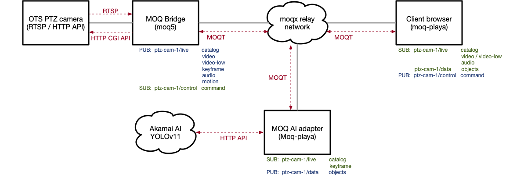

# moq-ptz-demo

PTZ demo split into four subprojects:

- [cam-moq-ui](cam-moq-ui/README.md): Browser UI for playback and PTZ controls.
- [cam-moq-av](cam-moq-av/README.md): RTSP camera video publisher to MOQT.
- [cam-moq-ptz](cam-moq-ptz/README.md): MOQT PTZ command receiver and camera control bridge.
- [cam-moq-ai](cam-moq-ai/README.md): Inference adapter to process video feed.

## Architecture



## Prerequisites

### 1. moq5 + picoquic

Both `cam-moq-av` and `cam-moq-ptz` link against prebuilt [moq5](https://github.com/openmoq/moq5) libraries
with its picoquic adapter. picoquic is **not bundled** in moq5 — clone it first, then build moq5
with the adapter flags enabled.

Complete these steps: [moq5 install](MOQ5_INSTALL.md)

### 2. System packages

| Package | Required by |
|---------|------------|
| OpenSSL | moq2ptz, vid2moq |
| CMake ≥ 3.16 | moq2ptz, vid2moq |
| ffmpeg | vid2moq (runtime, piped) |
| curl | moq2ptz (runtime, camera CGI) |
| Node.js + pnpm | ui |

## Setup

```sh
# 1. Build C publishers/receivers
cd cam-moq-av  && ./build.sh && cd ..
cd cam-moq-ptz  && ./build.sh && cd ..

# 2. Install UI dependencies
cd ui && pnpm install && cd ..
```

## Typical flow
1. Copy and configure `.env` in `cam-moq-ptz`, `cam-moq-av` and `cam-moq-ai` (`cp .env.example .env`).
2. Start the PTZ command receiver: `cd am-moq-ptz && ./ptz_rx.sh`
3. Start the video publisher: `cd am-moq-av && ./rtsp_tx.sh`
4. Start the inference adapter: `cd cam-moq-ai && ./moq_ai.sh`
5. Start the UI: `cd cam-moq-ui && pnpm dev`
6. Open the Vite URL in Chrome/Edge and connect to the same namespace: http://localhost:5173/simple/?url=RELAY_URL&ns=NAMESPACE